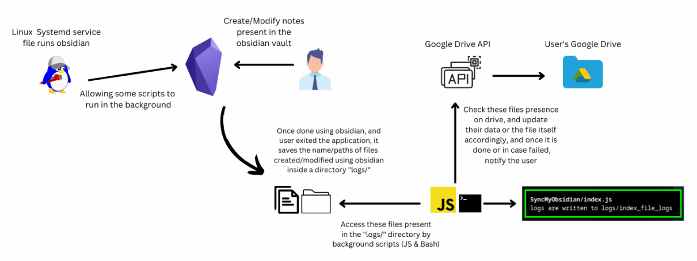
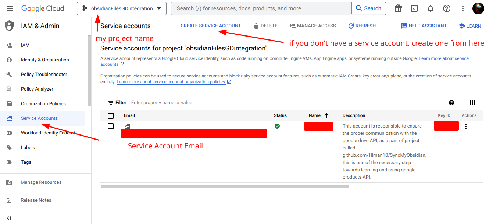
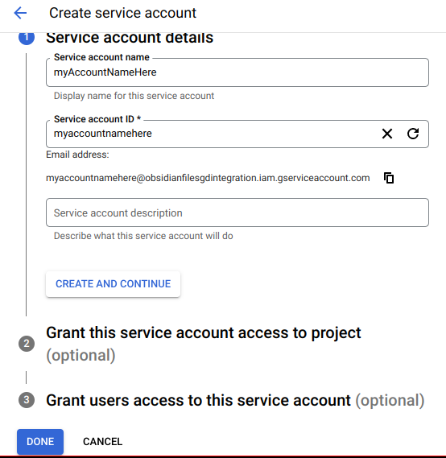
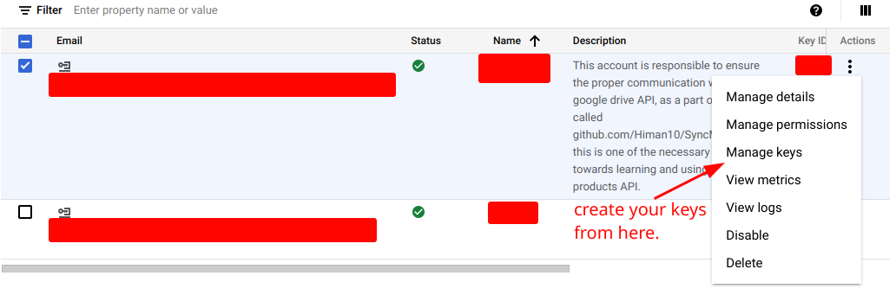
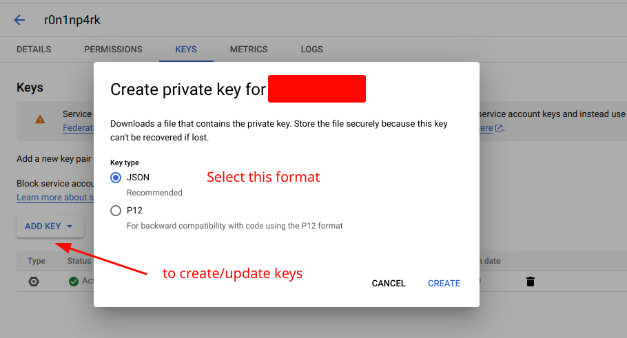
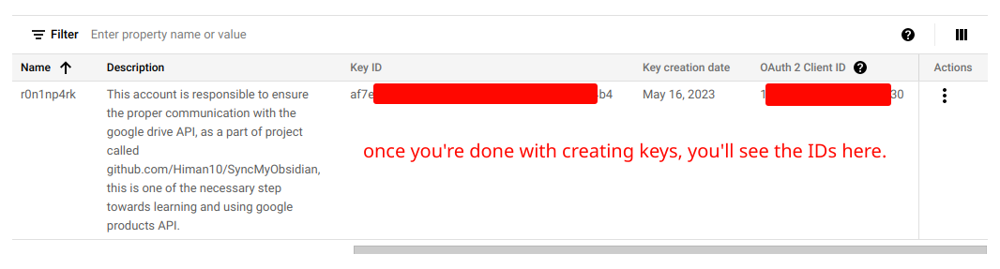

# Sync. With Ease

  
  

## Main Motivation
This project was created with the goal of syncing files in your Obsidian desktop and mobile application vaults without paying for a subscription. As lovers of all things free, be it food, PS 5s, money, relationships, or especially the open source community, Unfortunately we don't get as much as we fantasize about it, however this project, ah it's free.

To put it simply, suppose you have downloaded the Obsidian Application and created a vault, where you write notes and create wonderful content. Naturally, you'd like to access these notes on the go, but you can't always carry your laptop or the Obsidian desktop application with you. This is where the Obsidian mobile application comes in. However, in order to have the same notes on your mobile interface as in your computer's Obsidian vault, you need to synchronize between the two applications. Obsidian has its own cloud service to store and access files from different devices if you're using the same account, but as mentioned earlier, you need to pay for it.

Here's where this repository comes in. It takes care of the synchronization process and gives you the freedom to write notes and read them on any device where you're logged in with the same account. However, you will need to make some effort as well since this repository is not intelligent enough to do everything on its own.

## Main Functionality
So, basically this project's working is very simple and easily understandable if you're a linux user and has worked with systemd service files, or bash in general. I'd like to mention one thing that is very important for the end users, ***overall development of this project is done on Linux***. 

It doesn't follow any windows development patterns and architecture, so if you're a windows user, unfortunately, you won't get much but you can make a use of the Javascript file named `index.js` which focuses on how to upload files to the google drive. 

  
  

So, here the user needs to run obsidian application (or app Image) using the systemd service file, this service file is responsible for running some scripts in the background before and after running obsidian. 

- Script that runs before the obsidian sets up a log directory and ensures no content in terms of files to be present in the "logs/" directory. 

- The another script that runs after the obsidian gets closed, takes care of number of files user has created/modified in the obsidian vault, it keep tracks of those files and write their full path in a JSON based log file called "logs/modified_files.json". Later file paths written on this file is used by JS script to perform upload functionality. 

Above mentioned background scripts are:
1. [index.js](index.js) (Javascript)
2. [performStuff.sh](performStuff.sh) (Bash)

## Setting up the project    
    
  ### [ Requirements ]
  * LINUX *(There's no chance of this repo. to be run on windows platform, so having linux as your main or either side OS is necessary)*
  * Bash *(You already have it, if you meet the first requirement)*
  * Node JS & Some dependencies
    * googleapis
    * mime
  * Sign up for the GCP *(google cloud project)* 
  * Google service account and its credentials
  * Systemd
  * Little bit knowledge of systemd *(familiarity with commands is enough)*
  * Little knowledge of file/folder permissions in Linux 
  * Google Account & Google Drive *(well, it won't be possible without these two)*
  * ~A black hoddie, Mr. robot theme volumes, Dark room, ability to talk to yourself~
  
  ### [ Installation ]
  Install this github repo using the famous `git clone` CLI tool or however you like,    
  Remember to download this repo. in your `/home/yourUsername/` directory and `cd` into it. 
  
      
  ### [ Google service account set-up ]
  Basically, a *[service account](https://cloud.google.com/docs/authentication#service-accounts)* is provided by the GCP *(Google Cloud Platform)* that represents a service or application rather than an individual user. This service account is intended to facilitate and communicate with the google APIs like drive API, calender API, maps API etc.

  The reason why service account is necessary in this project because, 
  * first of all, we are not going to follow the OAuth process in order to provide authentication and authorization to user accounts to communicate with the google products and performing certain operations, if we do so, we have to deal with the access/refresh token and some extra steps of generating such credentials. Most importantly, in this project, we don't need to authorize any one or need N number of different accounts, Only a single account is the perfect to carry such operations on its shoulders.  

  * This service account is enough to authenticate/authorize the end-user working with this repo. to use the google products. 

  In this project, I've utilized this service account to perform operations provided by the [Google Drive API](https://developers.google.com/drive/api/guides/about-sdk).    
  Operations include :
  1. [Update](https://developers.google.com/drive/api/guides/manage-uploads) the content of existing files
  2. [Create](https://developers.google.com/drive/api/guides/create-file) new files if not exist already on drive
  3. [List](https://developers.google.com/drive/api/guides/search-files) files information
  4. [Delete](https://developers.google.com/drive/api/reference/rest/v3/drives/delete) specific files (not implemented yet)

  ***How you can get your own google service account :***    
  
  **Step 1:** Go to the [Google Cloud Platform](https://console.cloud.google.com/)
  
  **Step 2:** Create a project or select an existing one from the project dropdown menu    
  
  **Step 3:** Once created, go to the "IAM & Admin" option and select "Service Accounts", something like this will show up :    
      
      
  
  **Step 4:** Create your service account, here the "Service Account ID" is auto-generated, below this field, you'll see an Email address as well, it's not required to set-up other things.    
      
     
  
  **Step 5:** Right after the service account gets generated, you need to create credentials for it, select your recently created account name and click on "Manage keys". Here, click on "ADD KEY" to create a new key, then it'll ask you to create private key, remember to create your keys only in the JSON Format.    
      
    
     
  
  Once it's generated, download the credentials and ensure not to compromise for security risk.    
  **NOTE :** I recently came across the "Workload identify federation" that allows you to use your service account without its keys or credentials, this reduces the security risk in case your keys are compromised. I haven't used it, but will update here soon.    
      
  

  It's all done now, move forward to the next step
  
  ### Systemd service file set-up
  
  ### HOWIT works & HOWTO use
  
  ### Android Installation set-up

  ### Further Readings
