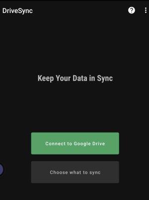
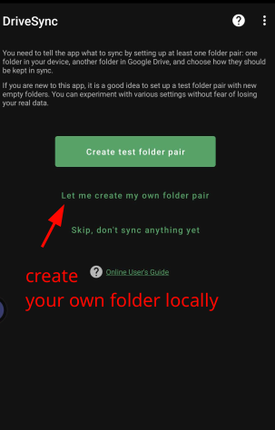
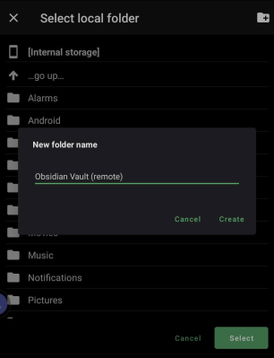
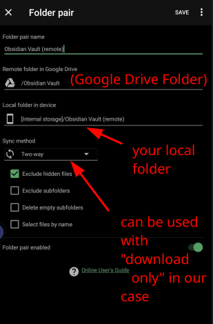
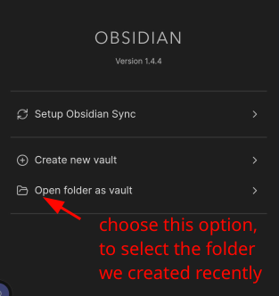
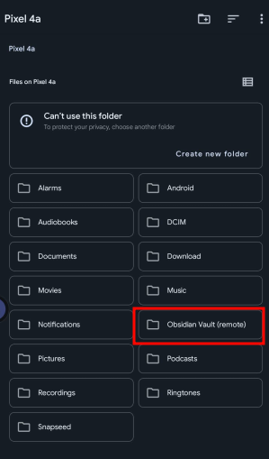
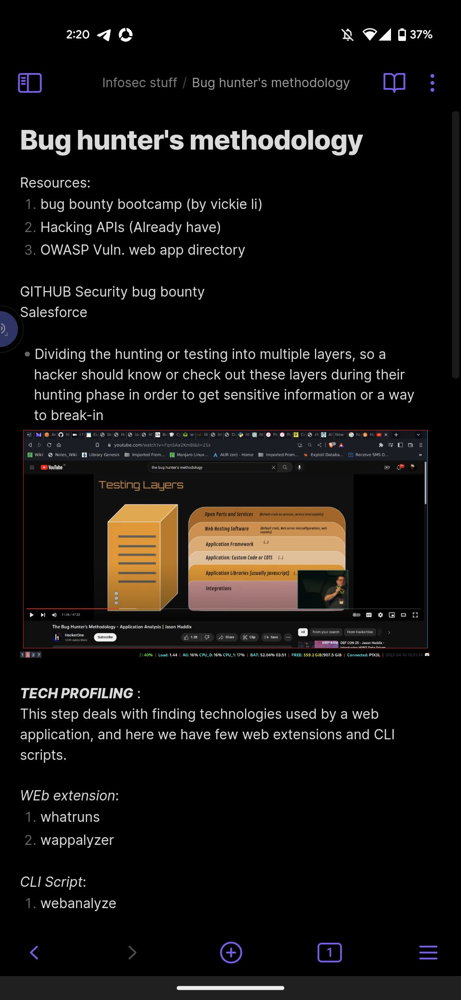
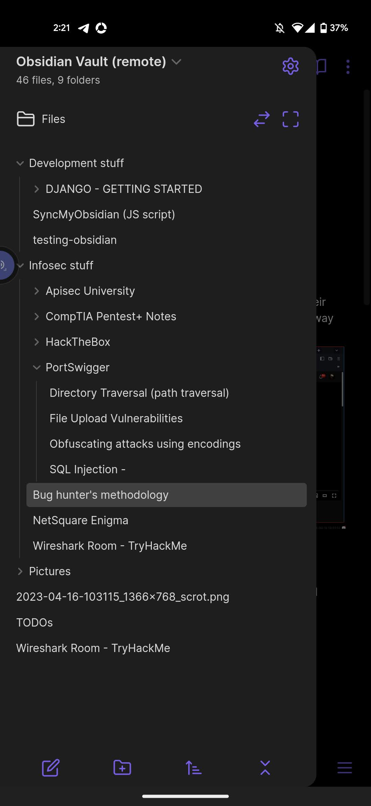

# Sync. With Ease
<p align="center">
  
  </p>

## Main Motivation
This project was created with the goal of syncing files in your Obsidian desktop and mobile application vaults without paying for a subscription. As lovers of all things free, be it food, PS 5s, money, relationships, or especially the open source community, Unfortunately we don't get as much as we fantasize about it, however this project, ah it's free.

To put it simply, suppose you have downloaded the Obsidian Application and created a vault, where you write notes and create wonderful content. Naturally, you'd like to access these notes on the go, but you can't always carry your laptop or the Obsidian desktop application with you. This is where the Obsidian mobile application comes in. However, in order to have the same notes on your mobile interface as in your computer's Obsidian vault, you need to synchronize between the two applications. Obsidian has its own cloud service to store and access files from different devices if you're using the same account, but as mentioned earlier, you need to pay for it.

Here's where this repository comes in. It takes care of the synchronization process and gives you the freedom to write notes and read them on any device where you're logged in with the same account. However, you will need to make some effort as well since this repository is not intelligent enough to do everything on its own.

## Main Functionality
So, basically this project's working is very simple and easily understandable if you're a linux user and has worked with systemd service files, or bash in general. I'd like to mention one thing that is very important for the end users, ***overall development of this project is done on Linux***. 

It doesn't follow any windows development patterns and architecture, so if you're a windows user, unfortunately, you won't get much but you can make a use of the Javascript file named `index.js` which focuses on how to upload files to the google drive. 
<p align="center">
  
  </p>

So, here the user needs to run obsidian application (or app Image) using the systemd service file, this service file is responsible for running some scripts in the background before and after running obsidian. 

- Script that runs before the obsidian sets up a log directory and ensures no content in terms of files to be present in the "logs/" directory. 

- The another script that runs after the obsidian gets closed, takes care of number of files user has created/modified in the obsidian vault, it keep tracks of those files and write their full path in a JSON based log file called "logs/modified_files.json". Later file paths written on this file is used by JS script to perform upload functionality. 

Above mentioned background scripts are:
1. [index.js](index.js) (Javascript)
2. [performStuff.sh](performStuff.sh) (Bash)

## Setting up the project    
    
  ### [ Requirements ]
  * LINUX *(There's no chance of this repo. to be run on windows platform, so having linux as your main or either side OS is necessary)*
  * Bash *(You already have it, if you meet the first requirement)*
  * NPM (Node package manager)
  * Sign up for the GCP *(google cloud project)* 
  * Google service account and its credentials
  * Systemd
  * Little bit knowledge of systemd *(familiarity with commands is enough)*
  * Little knowledge of file/folder permissions in Linux 
  * Google Account & Google Drive *(well, it won't be possible without these two)*
  * ~A black hoddie, Mr. robot theme volumes, Dark room, ability to talk to yourself~
  
  ### [ Installation ]
  Install this github repo using the famous `git clone` CLI tool or however you like,    
  Remember to download this repo. in your `/home/$(username)/` (or home) directory and `cd` into it.    
      
  Run `npm install` in SyncMyObsidian/, it'll read the `package.json` file and install all the required dependencies into your environment.
  
      
  ### [ Google service account set-up ]
  Basically, a *[service account](https://cloud.google.com/docs/authentication#service-accounts)* is provided by the GCP *(Google Cloud Platform)* that represents a service or application rather than an individual user. This service account is intended to facilitate and communicate with the google APIs like drive API, calender API, maps API etc.

  The reason why service account is necessary in this project because, 
  * first of all, we are not going to follow the OAuth process in order to provide authentication and authorization to user accounts to communicate with the google products and performing certain operations, if we do so, we have to deal with the access/refresh token and some extra steps of generating such credentials. Most importantly, in this project, we don't need to authorize any one or need N number of different accounts, Only a single account is the perfect to carry such operations on its shoulders.  

  * This service account is enough to authenticate/authorize the end-user working with this repo. to use the google products. 

  In this project, I've utilized this service account to perform operations provided by the [Google Drive API](https://developers.google.com/drive/api/guides/about-sdk).    
  Operations include :
  1. [Update](https://developers.google.com/drive/api/guides/manage-uploads) the content of existing files
  2. [Create](https://developers.google.com/drive/api/guides/create-file) new files if not exist already on drive
  3. [List](https://developers.google.com/drive/api/guides/search-files) files information
  4. [Delete](https://developers.google.com/drive/api/reference/rest/v3/drives/delete) specific files (not implemented yet)

  ***How you can get your own google service account :***    
  
  **Step 1:** Go to the [Google Cloud Platform](https://console.cloud.google.com/)
  
  **Step 2:** Create a project or select an existing one from the project dropdown menu    
  
  **Step 3:** Once created, go to the "IAM & Admin" option and select "Service Accounts", something like this will show up :    
      
      
  
  **Step 4:** Create your service account, here the "Service Account ID" is auto-generated, below this field, you'll see an Email address as well, it's not required to set-up other things.    
      
     
  
  **Step 5:** Right after the service account gets generated, you need to create credentials for it, select your recently created account name and click on "Manage keys". Here, click on "ADD KEY" to create a new key, then it'll ask you to create private key, remember to create your keys only in the JSON Format.    
      
    
     
  
  Once it's generated, download the credentials, ***rename it with "credentials.json"*** and ensure not to compromise for security risk.    
  **NOTE :** I recently came across the "Workload identify federation" that allows you to use your service account without its keys or credentials, this reduces the security risk in case your keys are compromised. I haven't used it, but will update here soon.    
      
  

  It's all done now, move forward to the next step
  
  ### [ Systemd service file set-up ]
  This project utilizes the [systemd](https://www.freedesktop.org/software/systemd/man/systemd.service.html) service files to manage the obsidian workflow. Basically, a service file defines various properties and
  behaviours of a process or service, in our case, we are going to create obsidian app. image as a service, and systemd will read this service to help us to start, stop, or monitor it with the help of [systemctl](https://www.freedesktop.org/software/systemd/man/systemctl.html).    
      
  Explaining how the systemd works isn't a scope of this project, I've already added one [systemd file](obsidian.service) which you can use with a little bit of modification.    
  So, Here's the format of our service file.    
  ```sh
  # this is a sample systemd service file for obsidian appImage
  [Unit]
  Description=Obsidian appImage service file

  [Service]
  User=$(whoami)
  Type=simple
  Environment=DISPLAY=:0
  Environment=DBUS_SESSION_BUS_ADDRESS=unix:path=/run/user/1000/bus
  ExecStartPre=/bin/bash /home/$(whoami)/SyncMyObsidian/performStuff.sh createLogs
  ExecStart=/home/$(whoami)/Applications/Obsidian-1.1.16_d65b59bd9180b1d95098945fe63107ac.AppImage
  ExecStop=/bin/bash /home/$(whoami)/SyncMyObsidian/performStuff.sh

  [Install]
  WantedBy=default.target
  ```
  Few things to note here:    
  * Replace the $(whoami) with the value you get after running `whoami` command on your terminal, simply saying, so your username it is. 
  * Calling script in the *ExecStartPre* will happen when you'll initiate the "start" command to start the obsidian service with the use of systemctl. 
  * Once the script mentioned above completes its execution, the control flow moves to *ExecStart*, now here you need to assign the absolute path of your obsidian application to this variable.
  * Again, once the previous script is done, now it's time to execute the scripts that'll be running after obsidian stops. 

  **IMPORTANT:** Now, seems like you've modified the file as per the above steps, now move this file in the `/etc/systemd/system/` directory. My distro is Arch based I am not sure if you have to same directory path, simply do a google search and you'll get it. Give required permissions to the `index.js` and `perform.js` so the service file will be able to execute them.   
      
  Finally, this is all you've to do in this step. 
  
  ### [ HOWTO use ]
  In order to make this project run, you'll need to first complete the above steps, once they are completed and you're ready to integrate this with the obsidian application, then here are the following commands and their explanations:    
      
  1. ***systemctl start obsidian:***     
  This command starts your obsidian application as a service, even the logs won't print out on stdout. 
  What happens underneath when you run this command is what you've to understand.
  <br><br>Absolute path of the script which you've provided to the *ExecStartPre* will execute at first, and it creates a "logs/" directory in the "SyncMyObsidian/" folder, and a file named "ObsidianServiceLogs" under the recently created dir. called "logs/". 
  <br> This log file keep tracks of all those files which have been modified after you started the obsidian. To check, the time & date when you run the application, it's also present in the same file, on the first line.     
  <br>For example:
  ```sh
  ┌──[hi-man@blackHat ~/SyncMyObsidian]
  └──$ >> cat logs/ObsidianServiceLogs 
  Thu May 25 05:02:25 PM IST 2023

  Modified Files after the above timestamp : 

  /home/hi-man/Documents/Obsidian Vault/TODOs.md
  ```
  
  2. ***systemctl stop obsidian:***    
  This command stops the obsidian application, and creates a file named "modified_files.json" under the "logs/" directory.    
  This file contains a JSON object where a key named "files" contains all the file paths that you've modified while using obsidian. This is an important file which is also used by the script mentioned in the *ExecStop*. If this file somehow isn't created, then there are going to be some issues with the code. You can also stop the application either by ctrl+c or clicking on 'x' button or however you like. 
  ```json
  {
    "files" : [
      "/home/hi-man/Documents/Obsidian Vault/TODOs.md"
    ]
  }
  ```
  
  3. ***systemctl status obsidian:***    
  To check live status of the service file running. In case of any issues, it'll be displayed here.
  
  Upon completion of these steps, you'll get a notification sent by the `notify-send` command, in case of a green notification bubble, means everything's good, in case of red notification bubble, means something is wrong. Check the logs of your service by running this `journalctl -u obsidian` to understand more about the issue. 
  
  ### [ Android Installation set-up ]
  Finally after setting up the service account, systemd file and understanding how both of them works, this time you'll need to install an application named [Autosync for Google Drive: DriveSync](https://play.google.com/store/apps/details?id=com.ttxapps.drivesync&hl=en_US). The only con this application comes with is the advertisement, However this application allows you to automatically synchronize the files between your mobile and desktop. Using this fundamental idea of DriveSync, we already have our obsidian vault files prsent on the google drive, now we can simply install this application and use it to get the files and display them on [obsidian mobile application](https://play.google.com/store/apps/details?id=md.obsidian).    
      
  Here are the steps of how you can achieve the auto sync. using the DriveSync.    
      
  **Step 1:** Install both the application.
      
  **Step 2:** Once installed, open the DriveSync application, you'll see two options there, give the necessary permissions and connect your google account with it.    
      
  
      
  **Step 3:** Click on the "Choose what to sync", and then create one folder locally that will be used to store the files downloaded from google drive. 
  
  
  
  
      
  **Step 4:** Open the obsidian application and choose the folder you'd like to open as an obsidian vault, remember only select that folder we created in step 3. 
      
  
  
      
  After this, all your notes and images will be displayed on your obsidian application, something like this: 
      
       
      
  That's all for now folks, still the development of this repo. is going on. 
